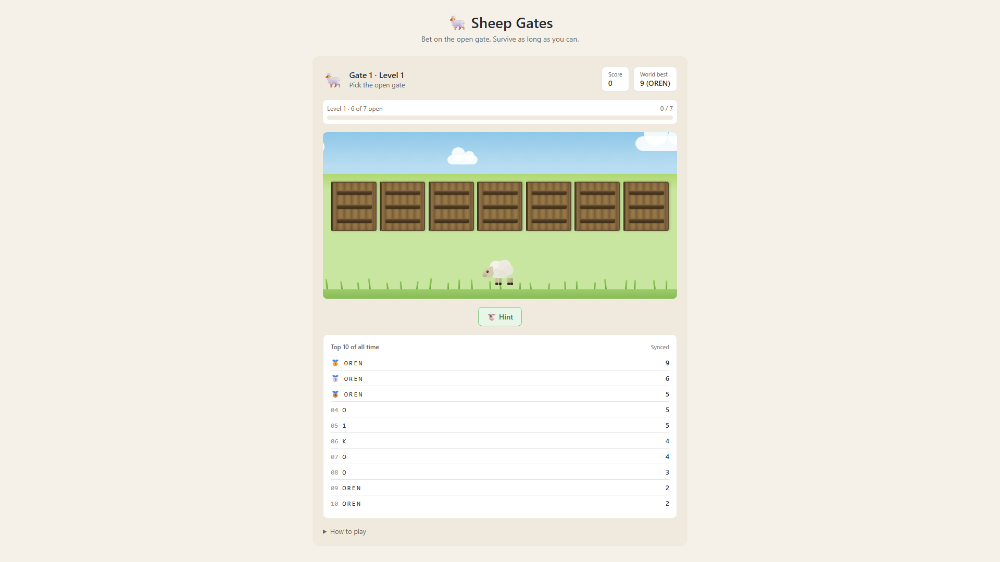

# 🐑 Sheep Gates

**Can you outrun the odds?**

Pick the open gate. Keep walking. Every level, one more gate locks — and the sheep has nowhere to hide.

**[Play now →](https://orenagassy.github.io/sheep/)**

---

## How it works

7 gates. One wrong pick and it's over. Clear enough gates and the next level locks one more — starting easy, ending brutal.

| Level | Open gates |
|-------|-----------|
| 1 | 6 of 7 |
| 2 | 5 of 7 |
| … | … |
| 6 | 1 of 7 |

---

## Modes

**Normal** — play at your own pace. Top scores go on the global leaderboard.

**📅 Daily** — everyone faces the same gate sequence each day. One shared challenge. One chance to top the daily board.

**⚡ Sport** — 8 seconds per gate or the wolf gets you. Pick fast for bonus points: under 1 second scores +3, under 2.5 seconds scores +2, under 4 seconds scores +1. The faster you play, the further you climb.

---

## Features

- 🔥 **Streak counter** — build momentum and watch the fire grow
- ✕ **Near-miss reveal** — after a good pick, see just how close the blocked gates were
- 🏆 **Achievements** — 9 badges to unlock across all your runs
- 📊 **All-time stats** — gates cleared, games played, best level, hints found
- 🥇 **Leaderboards** — separate Top 10 for Normal, Daily, and Sport
- 🐮 **Hint** — spend one per run to mark a bad gate. Lucky sheep sometimes find hints on their own
- 📱 **Haptic feedback** — feel every gate and every crash on mobile
